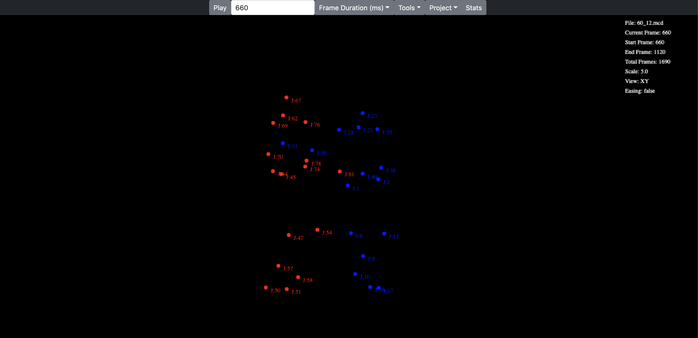

# MoCap-GLSL-Generator
Motion Capture GLSL Generator

This is a tool for generating GLSL shader code from well-formatted C3D & TRC motion capture files and is very much 
a work in progress. The tool can import motion capture data to view, edit and create loops or sequences, which 
can then be used to generate compact GLSL code suitable for use in 
WebGL applications such as Shadertoy (data is compressed using Fourier transforms and data encoding).  

This tool was created using Java 11, Spring Boot and React and can be run using the following:

*./gradlew :bootRun*

once running open your browser and goto http://localhost:8080

A public docker image is also available on Docker Hub

*docker pull shaugraphics/mocapweb:1.0.0*

A sample project .mcd and generated GLSL fourier code .msh can be found in the samples folder. 
The project was imported using data from http://mocap.cs.cmu.edu/search.php?subjectnumber=60/60_12.c3d

